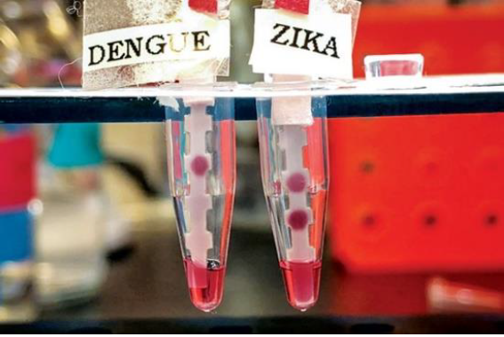
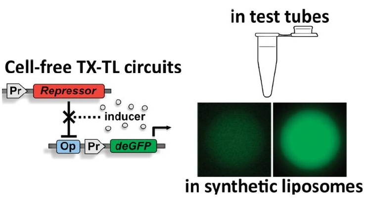

##### By Burhan Sabuwala 

<b> Introduction </b>

Life has evolved on earth for about 3.5 billion years and has survived all odds ranging from volcano eruption to asteroid impact events. This has been possible because life has the ability to reproduce, evolve and adapt to its surroundings. Now, with recent discoveries and the available modern technologies, we can manipulate organisms to do something that suits our purpose. For example, we have been using microorganisms to produce alcohol, bread, curd, etc. However, we now have technologies to cut and paste DNA. We can also synthesize new DNA which can be used in making novel proteins that can perform novel functions. It can also be used to create genetic circuits, analogous to electrical circuits, which can perform various functions like oscillation, switch-like behaviour, memory storage, etc. Engineering life to create something that is not found in nature and can have a useful purpose is synthetic biology.
Lots of research has been done in Synthetic Biology and many of its applications have been shown in a variety of fields such as Detection of Heavy Metals using biosensors, manufacturing of certain macromolecules and polymers using microorganisms or cell cultures, diagnostics, bioremediation, producing cleaner and cheaper energy, and many more. However, not many of these inventions have come out of the lab. The major reason for this is the problem of biosafety. The organism that is modified to do a certain task cannot be released in the environment as we do not know how it will interact with the environment outside the lab.

<b> Cell-free systems </b> 

Cell-free systems (CFSs) are basically all components of the cell that are required for our function of interest without a cell wall. For example, if we want overexpression of a protein, we can have DNA coding for the protein, RNA polymerase to form mRNA, ribosomes, tRNA and amino acids in a solution. Start-ups like GreenLight and Sutro have shown low-cost production of RNA and protein from cell-free systems which are quite safe for use. Another example of cell-free systems is PCR where we can amplify a specific DNA sequence without using any cells in a solution. This process is very quick.
This overcomes the issue of biosafety as the components cannot multiply themselves without cells. A simple process of filtering gives a bio-safe format for distribution outside the lab. Moreover, it allows for quick characterization of genetic circuits that we intend to build. It also minimizes cross-talk (interaction of our module of interest with other modules which leads to unexpected outcomes) as there is a minimum number of components in the system, unlike in cells. This also ensures better control over the process of the system, a privilege which we usually don't have while working with cells.
Another great advantage of cell-free systems is easy storage and transport. After a process called freeze-drying which is basically drying out all water at low temperature, we can store the contents for over a year and even transport or distribute it.

<b> Paper-Based Diagnostics </b>

Many groups across the globe have been working on paper-diagnostics. It is similar to using a pH paper to detect pH. The only change is you can use it for many more purposes. The paper can have genetic circuits that get activated upon exposure to water or a buffer and can be used to detect Mercury contamination or the presence of a virus (such as Zika, Dengue or Nipah). These paper-based diagnostics would be cheap and bio-safe to be used on the field and would be especially useful in case of an epidemic.

Paper-based methods are also very relevant to agriculture which is usually decentralized and access to lab testing is difficult. Paper-based synthetic biology methods can be developed to characterize soil nutrients or plant diseases. Such methods can be very beneficial to agriculture.

<b> Production of Therapeutics </b>

Cell-free systems have been useful for producing many peptide-based therapeutics such as vaccines, antimicrobial peptides, some antibiotics and even safe production of bacteriophages that can be useful for bacteriophage-based therapeutics. Many proteins require post-translational modifications such as phosphorylation that activates the protein, most of which are shown to be achievable in CFS.
CFS also allows for the protection of intellectual property as codon tables can be easily modified. This allows for easy encryption of intellectual property.

<b> CFS as a Platform for Discovery </b> 

CFSs are easy to work with compared to microorganisms or cell lines when it comes to protein engineering as it is easy to crystallize. CFSs have been very useful in metabolic engineering and several groups are able to put long pathways in CFSs and also scale up to process to about 100 litres. Liposomes are enclosed lipid bilayer spheres. Genetic circuits can be enclosed in liposomes and can be prototyped individually in a single system. Membrane proteins can be easily studied on cell-free systems containing liposomes, emulsions, micelles, or oil-water interface.
CFSs can also be used for efficient energy storage. However, the research on this is still in its nascent stages. Maltodextrose based batteries have much higher energy density compared to even lithium-ion batteries.

<b> Role of CFS in Education </b>

CFS can be extensively used in education and spreading awareness about synthetic biology. Since it is bio-safe, it can be taken out of the lab to schools and education centres and some live experiments can be shown.

CFS technology has immense potential because of its bio-safe format, lack of a cell wall allowing for rapid prototyping, and better control over the system. It has immense potential in various areas ranging from diagnostics, agriculture, peptide-based therapeutics, metabolic engineering, bioremediation, energy storage, and spreading awareness about synthetic biology.

<b> Reference </b>

Tinafar A, Jaenes K, Pardee K. Synthetic Biology Goes Cell-Free. BMC Biol. 2019 Aug 8;17(1):64. doi: 10.1186/s12915-019-0685-x.
